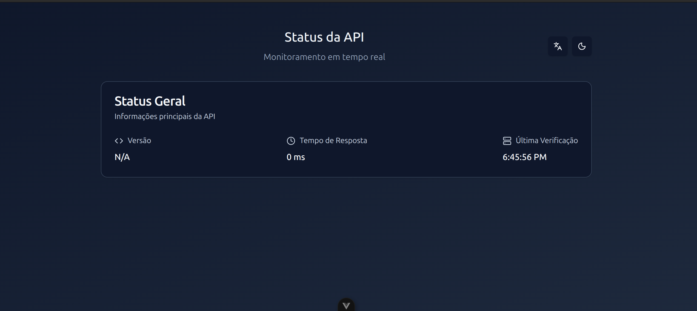

# Monorepo Template

A modern monorepo template using pnpm workspaces, Vue 3, NestJS, and Docker.



## Prerequisites

- Node.js >= 22.15.0
- pnpm >= 9.15.2
- Docker & Docker Compose

## Getting Started

### Install Dependencies

```bash
# Install dependencies for all workspaces
pnpm install

# Or install dependencies using Docker
docker compose run server pnpm install
```

### Running the Applications

```bash
# Run both client and server with Docker Compose
docker compose up

# Or run individually
docker compose up client
docker compose up server
```

### Available Scripts

#### Client

```bash
# Development
pnpm client:dev

# Production build
pnpm client:build
pnpm client:preview

# Testing
pnpm client:test:unit          # Run unit tests
pnpm client:test:e2e           # Run E2E tests
pnpm client:test:e2e:ui        # Run E2E tests with UI
pnpm client:test:e2e:headed    # Run E2E tests in headed mode
pnpm client:test:e2e:debug     # Run E2E tests in debug mode

# Type checking
pnpm client:type-check

# Linting
pnpm client:lint
```

#### Server

```bash
# Development
pnpm server:dev

# Production build
pnpm server:build
pnpm server:start:prod

# Testing
pnpm server:test           # Run all tests
pnpm server:test:unit      # Run unit tests
pnpm server:test:e2e       # Run E2E tests
pnpm server:test:cov       # Run tests with coverage
pnpm server:test:ui        # Run tests with UI

# Linting
pnpm server:lint
```

## Project Structure

```
.
├── client/           # Vue 3 frontend application
│   ├── src/
│   │   ├── api/           # API client
│   │   ├── components/    # Vue components
│   │   ├── i18n/          # Internationalization (en-US, pt-BR, es-ES)
│   │   ├── layouts/       # Layout components
│   │   ├── pages/         # Page components
│   │   ├── router/        # Vue Router configuration
│   │   └── utils/         # Utility functions
│   └── test/
│       ├── e2e/           # Playwright E2E tests
│       └── unit/          # Vitest unit tests
├── server/           # NestJS backend application
│   ├── src/
│   │   └── modules/       # API modules
│   └── test/
│       ├── e2e/           # E2E tests
│       └── unit/          # Unit tests
├── pnpm-workspace.yaml
├── pnpm-lock.yaml
└── docker-compose.yaml
```

## Features

### Client (Vue 3)
- ⚡️ Vue 3 with TypeScript
- 🎨 Tailwind CSS v4 for styling
- 🌐 i18n support (English, Portuguese, Spanish)
- 🎭 Playwright for E2E testing
- ⚡ Vitest for unit testing
- 🎯 Vue Router for routing
- 🌗 Dark mode support
- 📱 Responsive design
- 🧩 shadcn-vue components

### Server (NestJS)
- 🚀 NestJS framework
- 📝 Swagger API documentation
- 🧪 Jest for testing
- 🐳 Docker ready

### DevOps
- 📦 Automated versioning with semantic-release
- 📝 Automatic CHANGELOG generation
- 🔄 GitHub Actions CI/CD
- 🏷️ Git tag management
- 📋 Conventional Commits

## Versioning

This project uses [semantic-release](https://github.com/semantic-release/semantic-release) for automated versioning and changelog generation.

### Commit Convention

Follow [Conventional Commits](https://www.conventionalcommits.org/) specification:

- `feat:` - New feature (minor version bump)
- `fix:` - Bug fix (patch version bump)
- `feat!:` or `BREAKING CHANGE:` - Breaking change (major version bump)

See [COMMITS.md](./COMMITS.md) for detailed commit guidelines.

### Release Process

Releases are automatically created when commits are pushed to the `main` branch. The GitHub Actions workflow will:
1. Analyze commits since the last release
2. Determine the next version number
3. Generate/update CHANGELOG.md
4. Create a Git tag
5. Publish a GitHub release

## Access URLs

### Client Application

- Development: http://localhost:5173
- Production preview: http://localhost:4173

### API Documentation

- Swagger UI: http://localhost:3000/swagger
- Scalar API Docs: http://localhost:3000/docs

## License

MIT
